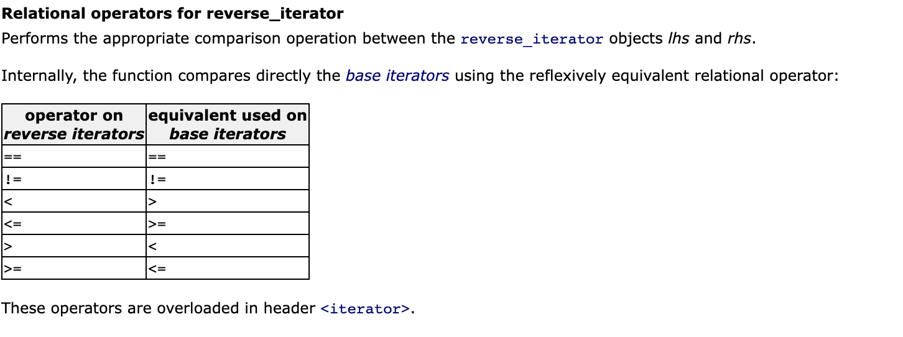

# Containers Reimplementation (C++98)
<a href="en.subject.pdf"> Subject </a>

I used these links to build the project. :
https://www.cplusplus.com/reference/iterator/iterator_traits/
https://www.cplusplus.com/reference/iterator/reverse_iterator/
https://en.cppreference.com/w/cpp/iterator/reverse_iterator
https://en.cppreference.com/w/cpp/iterator/reverse_iterator/reverse_iterator
https://www.cplusplus.com/reference/iterator/iterator/
https://adrienblanc.com/projects/42/ft-containers

# Iteratos in c++
An iterator is an object (like a pointer) that points to an element inside the container.
We can use iterators to move through the contents of the container. They can be
visualised as something similar to a pointer pointing to some location and we can
access content at that particular location using them.
Iterators play a critical role in connecting algorithm with containers along with the
manipulation of data stored inside the containers. The most obvious form of iterator is a
pointer. A pointer can point to elements in an array, and can iterate through them using
the increment operator (++). But, all iterators do not have similar functionality as that of
pointers.
Depending upon the functionality of iterators they can be classified into five categories,
as shown in the diagram below with the outer one being the most powerful one and
consequently the inner one is the least powerful in terms of functionality.

<h3> Container && Types of Iterator Supported </h3>
Vector    -> Random-Access
Map       -> Bidirectional
Set       -> Bidirectional
Stack     -> No Iterator Supported

<h3> Random-access Iterators in C++ </h3>
Random-access iterators are iterators that can be used to access elements at an
arbitrary offset position relative to the element they point to, offering the same
functionality as pointers. Random-access iterators are the most complete iterators in
terms of functionality

<h3> Bidirectional Iterators in C++ </h3>
Bidirectional iterators are iterators that can be used to access the sequence of elements in a
range in both directions (towards the end and towards the beginning). They are similar to
forward iterators, except that they can move in the backward direction also, unlike the forward
iterators, which can move only in the forward direction.

https://home.csulb.edu/~pnguyen/cecs282/lecnotes/iterators.pdf

# What is the purpose of the explicit keyword? #
To tell the compiler that a certain constructor may not be used to implicitly 
cast an expression to its class type.
The explicit keyword is an optional decoration for constructors that take exactly
one argument. It only applies to single-argument constructors since those are the
only constructors that can be used in type casting.

-> https://www.cs.technion.ac.il/users/yechiel/c++-faq/explicit-ctors.html

# relational operators (reverse_iterator)
https://www.cplusplus.com/reference/iterator/reverse_iterator/operators/

 
  

# Difference between friend, protect, private?
** Protected access modifier is similar to that of private access modifiers,
the difference is that the class member declared as Protected are inaccessible outside
the class but they can be accessed by any subclass(derived class) of that class.

** The class members declared as private can be accessed only by the functions inside 
the class. They are not allowed to be accessed directly by any object or function outside
the class. Only the member functions or the friend functions are allowed to access 
the private data members of a class.

** Friend Class A friend class can access private and protected members of other class 
in which it is declared as friend. It is sometimes useful to allow a particular class 
to access private members of other class. For example, a LinkedList class may be allowed 
to access private members of Node. 

https://www.geeksforgeeks.org/difference-between-private-and-protected-in-c-with-example/

# what is typename, typedef?
typedef is defining a new type for use in your code, like a shorthand.
**********************************************************************
example :
typedef typename _MyBase::value_type value_type;
value_type v;
//use v
*************************************************************************
typename here is letting the compiler know that value_type is a type and not a static member of _MyBase.
the :: is the scope of the type. It is kind of like "is in" so value_type "is in" _MyBase.
or can also be thought of as contains.
https://stackoverflow.com/questions/18385418/c-meaning-of-a-statement-combining-typedef-and-typename

# Red Black Trees Implementation

In computer science, a red–black tree is a kind of self-balancing binary search tree.
Each node stores an extra bit representing "color" ("red" or "black"), used to ensure that the 
tree remains balanced during insertions and deletions.
When the tree is modified, the new tree is rearranged and "repainted" to restore the coloring properties 
that constrain how unbalanced the tree can become in the worst case. The properties are designed such that 
this rearranging and recoloring can be performed efficiently.

A red-black tree satisfies the following properties:
Red/Black Property: Every node is colored, either red or black.
Root Property: The root is black.
Leaf Property: Every leaf (NIL) is black.
Red Property: If a red node has children then, the children are always black.
Depth Property: For each node, any simple path from this node to any of its descendant 
leaf has the same black-depth (the number of black nodes).

https://algorithmtutor.com/Data-Structures/Tree/Red-Black-Trees/
https://www.programiz.com/dsa/red-black-tree
https://www.geeksforgeeks.org/c-program-red-black-tree-insertion/
https://proprogramming.org/red-black-treerb-tree-implementation-in-c/
https://en.wikipedia.org/wiki/Red%E2%80%93black_tree

# Map Implementation
<h3> Resume </h3>
std::map is a sorted associative container that contains key-value pairs
with unique keys. Keys are sorted by using the comparison function Compare.
Search, removal, and insertion operations have logarithmic complexity. 
Maps are usually implemented as red-black trees.

https://www.cplusplus.com/reference/map/map/?kw=map
https://en.cppreference.com/w/cpp/container/map

# Set Implementation
<h3> Resume </h3>
std::set is an associative container that contains a sorted set of unique objects of type
Key. Sorting is done using the key comparison function Compare. Search, removal, and 
insertion operations have logarithmic complexity. Sets are usually implemented as red-black trees.

Everywhere the standard library uses the Compare requirements, uniqueness is determined by 
using the equivalence relation. In imprecise terms, two objects a and b are considered 
equivalent if neither compares less than the other: !comp(a, b) && !comp(b, a).

https://www.cplusplus.com/reference/set/set/?kw=set
https://en.cppreference.com/w/cpp/container/set